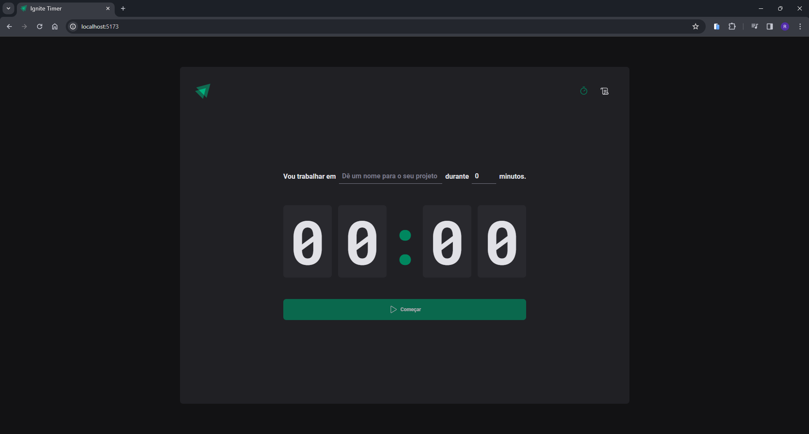

# Trilha Ignite - Timer 📚

# Notas 💭

> ## Ignite Timer ⏲️
Este é um projeto de timer pomodoro desenvolvido em colaboração com a RocketSeat, utilizando Vite e os principais conceitos do React. O projeto oferece uma aplicação com funcionalidades avançadas para gerenciamento de tempo, permitindo aos usuários criar timers para suas tarefas com intervalos definidos.

Além disso, os usuários podem registrar suas atividades em um histórico detalhado, que lista todas as tarefas juntamente com seu status de conclusão ou se foram interrompidas pelo usuário.

Este projeto faz uso extensivo dos principais hooks do React, incluindo useState, useEffect, useContext e useReducer, proporcionando uma experiência de desenvolvimento rica e eficiente. Adicionalmente, incorpora diversas bibliotecas que serão detalhadas abaixo.

 
 

> ## Tecnologias 👨🏾‍💻
Foram utilizadas as seguintes tecnologias neste projeto:
+ React.Js + TypeScript :
  -  Lib Js para desenvolvimento de interfaces modernas baseadas em componentes.
+ Vite.Js:
  - Ambiente de desenvolvimento.
+ Syled Components:
  - Estilizador de componentes.
+ React Hook Form:
  - Lib de gerenciamento de formulários para React.
+ Date Fns:
  - Lib de manipulação de datas.
+ date-fns:
  - Lib de manipulação e gerenciamento de datas.
+ Immer:
  - Lib gerenciamento de estados de forma mutável.
+ Phosphor React:
  - Lib icons para o react.
+ Zod:
  - Lib validação de formulários.

 
 

> ## Printscreen do Projeto 📸

 
 

> ## Autor 📝
+ [Ruan Cardoso](https://www.linkedin.com/in/ruancardosolinkdin/)
